# Job Application Tracker — Web App

A React single-page application for tracking job applications through the hiring
pipeline: what you applied to, where each application stands, and the notes you took
along the way.

This is the frontend. It talks to the [Job Application Tracker API](https://github.com/Anshika-320/job-application-tracker),
a Spring Boot service backed by PostgreSQL.

> **Live setup:** run the API first, then `npm run dev`. See [Getting started](#getting-started).

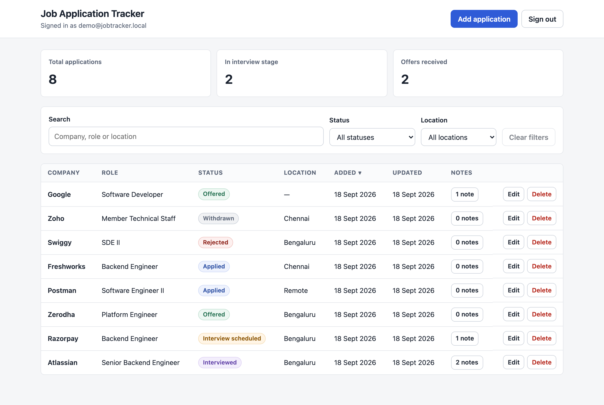

---

## Contents

- [Features](#features)
- [Tech stack](#tech-stack)
- [Screenshots](#screenshots)
- [Prerequisites](#prerequisites)
- [Getting started](#getting-started)
- [Available scripts](#available-scripts)
- [How data loading works](#how-data-loading-works)
- [Project structure](#project-structure)
- [Testing](#testing)
- [Accessibility](#accessibility)

---

## Features

**Authentication**
- Email and password sign-in against the real API
- JWT stored for the session, sent as a `Bearer` token on every protected request
- Automatic sign-out when the token expires, plus a clear message explaining why
- Distinct handling for wrong credentials, validation errors and an unreachable server

**Application management**
- Create, edit and delete applications
- Delete is guarded by a confirmation dialog naming the record
- Client-side validation before the request, and server validation errors rendered
  against the field that caused them

**Search and filtering**
- Free-text search across company, role and location
- Status filter and location filter, both served by dedicated API routes
- Sort by any column, with client-side pagination

**Notes**
- A notes dialog per application, backed by the nested notes API
- Add and delete notes, with a live character counter and a 500-character limit
- Note counts shown per row on the dashboard

**Interface**
- Loading, empty, error and no-results states throughout
- Responsive from desktop down to 390px, where the table becomes stacked cards
- Keyboard-usable dialogs with focus trapping, Escape to close and focus restoration

---

## Tech stack

| Concern | Choice |
| --- | --- |
| Framework | React 19 |
| Build tool | Vite 8 |
| Styling | Plain CSS with custom properties |
| Testing | Vitest 5 + React Testing Library |
| Linting | ESLint 10 flat config |
| State | React state and context — no external state library |

No UI kit, no CSS framework and no router. The app has two screens, so routing is
driven by authentication state, and every component is written against the platform.

---

## Screenshots

### Sign in

| Sign in | Rejected credentials |
| --- | --- |
| 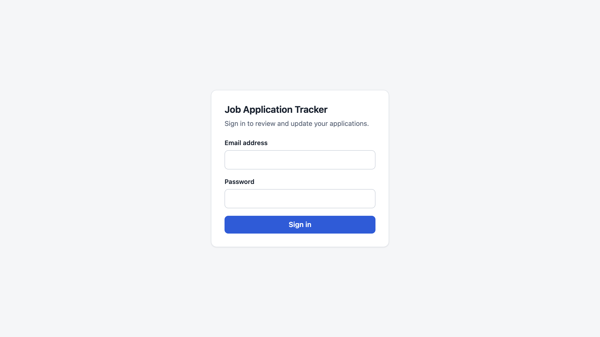 | 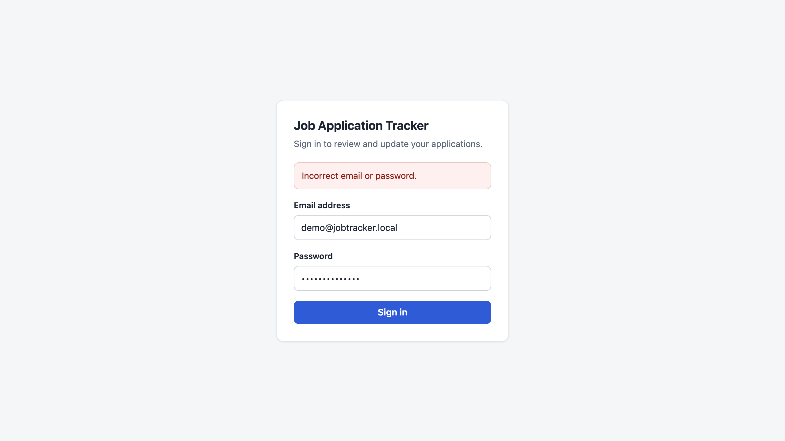 |

### Dashboard and filtering

Filtering by status, which is served by `GET /api/applications/status`:

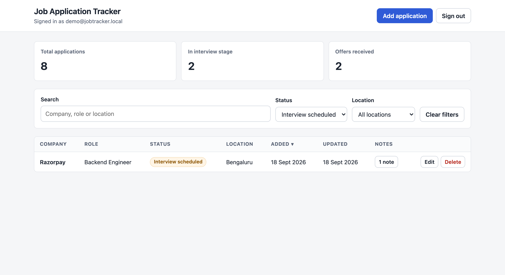

Free-text search matching across company, role and location:

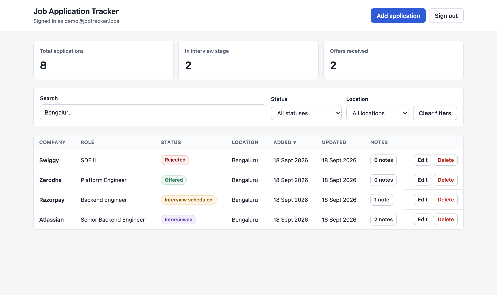

When nothing matches, the app says so instead of showing an empty table:

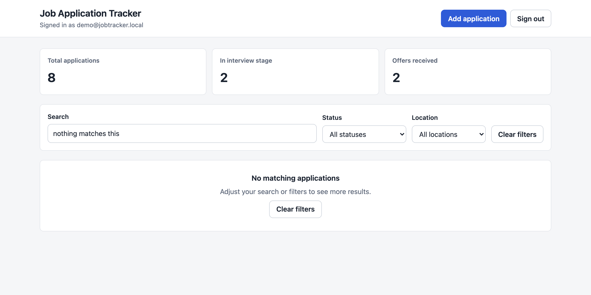

### Creating and editing

| Add an application | Validation errors |
| --- | --- |
| 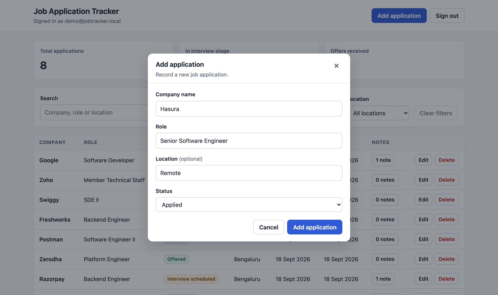 | 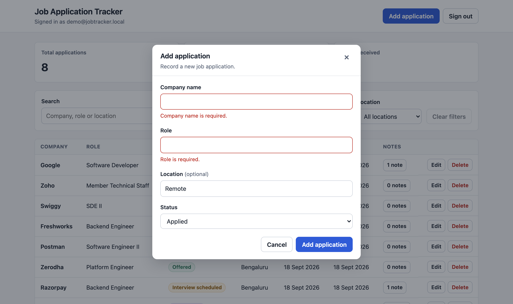 |

### Notes and deletion

| Notes | Delete confirmation |
| --- | --- |
| 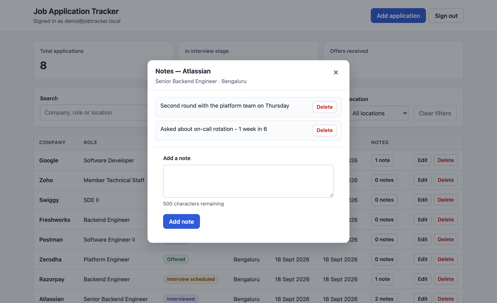 | 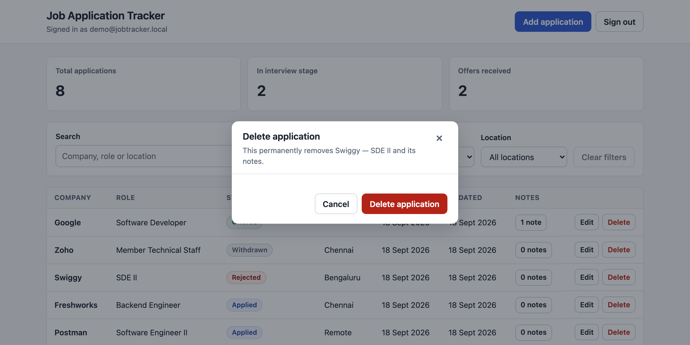 |

### Mobile

| Dashboard | Sign in |
| --- | --- |
| 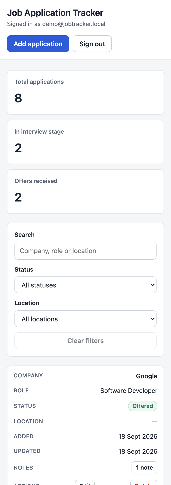 | 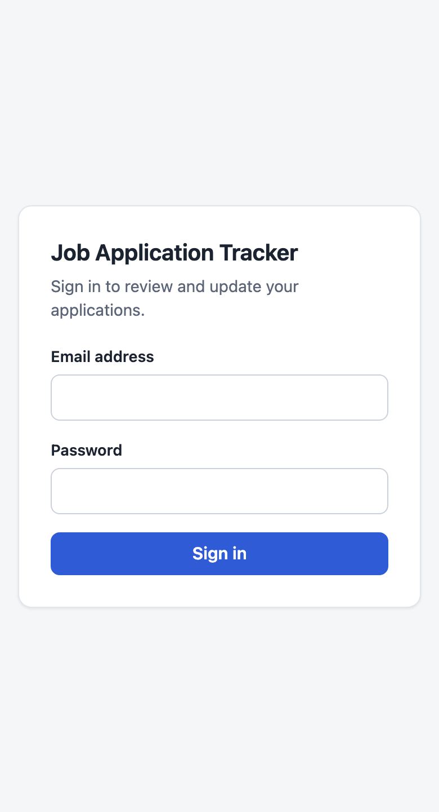 |

---

## Prerequisites

| Requirement | Version | Notes |
| --- | --- | --- |
| Node.js | 20.19+, 22.13+ or 24+ | Required by Vite 8 and ESLint 10. Check with `node -v` |
| npm | 10+ | Ships with Node.js |
| Job Application Tracker API | — | Must be running, by default on `http://localhost:8080` |

The API in turn needs Java 17 and PostgreSQL. See the API repository's README for
its setup, including how to create a sign-in account and seed demo data.

---

## Getting started

```bash
git clone <this-repository>
cd <repository>
npm install
npm run dev
```

The app is served at **http://localhost:5173**.

### Talking to the API

The dev server proxies `/api` to `http://localhost:8080`, so the browser makes
same-origin requests and no CORS configuration is needed for local development.

Point the proxy somewhere else with an environment variable:

```bash
VITE_API_PROXY_TARGET=http://localhost:9090 npm run dev
```

In production the app is deployed separately from the API, so the browser makes
cross-origin requests. Add the frontend's origin to the API's `FRONTEND_ORIGIN`
setting:

```bash
FRONTEND_ORIGIN=https://your-frontend-host
```

### Signing in

There is no self-service registration, so the account must already exist in the API
database. The API creates one at startup under the `dev` profile — see its README.

---

## Available scripts

| Command | Purpose |
| --- | --- |
| `npm run dev` | Start the dev server with the API proxy |
| `npm run build` | Production build into `dist/` |
| `npm run preview` | Serve the production build locally |
| `npm run lint` | Run ESLint |
| `npm test` | Run the Vitest suite |

---

## How data loading works

The app keeps the full application list from `GET /api/applications` in memory. That
one response drives the dashboard totals, the location dropdown options, and the text
search, sorting and pagination — all of which run in the browser so filters combine
instantly.

Two filters map cleanly onto existing API routes and are sent to the server:

| Filter | Route |
| --- | --- |
| Status | `GET /api/applications/status?status=` |
| Location | `GET /api/applications/location?location=` |

When both are set, the status route runs on the server and the location is applied to
its result, because no single route accepts both.

While a filtered request is in flight, the list is narrowed locally from the cached
data rather than showing the previous filter's results. Without this the table would
briefly display rows belonging to the filter the user just moved away from.

Per-row note counts come from `GET /api/applications/note-counts`.

---

## Project structure

```
src/
  api/
    client.js         fetch wrapper: auth header, error normalisation, abort handling
    endpoints.js      one function per API route
  auth/
    AuthProvider.jsx  session state, login and logout
    token.js          JWT decoding, expiry checks, storage
    useAuth.js        context hook
  components/         screens and UI pieces
  constants/          application status values and labels
  hooks/
    useApplications.js  list loading, server filters, local narrowing
  utils/              formatting helpers
  styles.css          design tokens and all component styles
```

All network calls live in `src/api`. Components never call `fetch` directly.

---

## Testing

```bash
npm test
```

49 tests covering:

- **API client** — auth headers, `204` handling, the two distinct error shapes the
  backend returns, expired-session detection, network failures and aborts
- **Token helpers** — decoding, expiry, malformed input
- **Login** — field validation, trimmed submission, rejected credentials, backend
  field errors, unreachable API
- **Dashboard** — totals, empty and error states, search across all three fields,
  both server-side filters, create and edit payloads, delete confirmation, and a
  regression test ensuring a filter switch never shows the previous filter's rows
- **Notes** — listing, empty state, blank-note rejection, add, delete, Escape to close

---

## Accessibility

- Every input has a visible `<label>`; errors are tied to fields with
  `aria-describedby` and `aria-invalid`
- Dialogs use `role="dialog"` with `aria-modal`, trap focus, close on Escape and
  restore focus to the trigger on close
- Sortable column headers expose `aria-sort`
- Row actions carry explicit `aria-label`s, so "Edit" announces as "Edit Atlassian"
- Status messages and errors use `role="status"` and `role="alert"`
- Visible focus rings on all interactive elements
